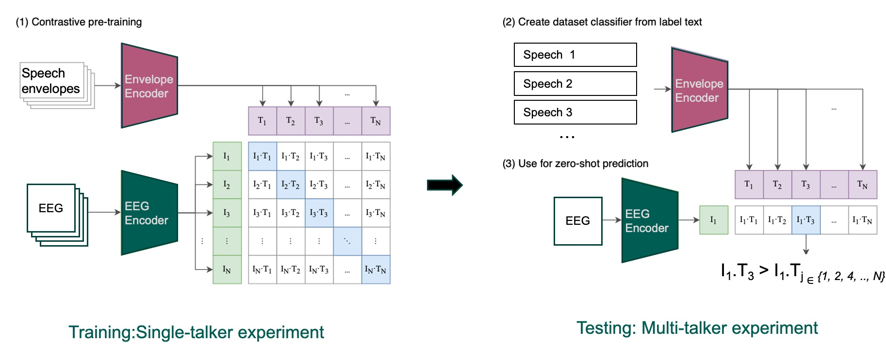
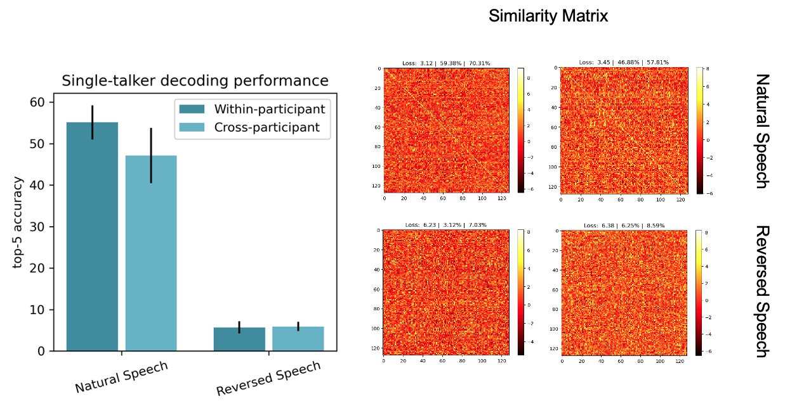

# Brain-Speech CLIP: Contrastive Learning for EEG and Speech Envelope Alignment

In a situation where multiple conversations happening around us. Despite the noise, human listeners have an extraordinary ability to focus on a single speaker while ignoring others. Our project dives into this, hypothesizing that the speech representations we attend to align more closely with our EEG brainwave patterns than those we ignore.

We introduce **Brain-Speech CLIP**, a contrastive learning framework inspired by the CLIP model. Our innovative approach trains the model to maximize the similarity between EEG and speech envelope representations of attended speech, while minimizing the similarity for unattended speech.

### Key Features
- **Novel Contrastive Learning Framework**: Leverages the power of contrastive learning to bridge the gap between brainwave and speech representations.

- **Between experiment Generalization**: The model was trained on EEG data from one experiment and tested on EEG data from another experiment.

- **Between Task Generalization**: The model was trained on matching speech representations with EEG representations but tested on identifying the attended speech in a multi-talker scenario.

- **Zero-Shot Learning**: Capable of generalizing to new, unseen data without additional training.

### Model Architecture




### Results
Our model achieved top-5 accuracy of 60 % on alighning EEG and speech envelope representations. The model also achieved an accuracy of 91% on identifying the attended speech in a multi-talker scenario.




# Installation

Clone the repository and and change the directory to the project folder:
```bash
git clone https://github.com/kmahjoory/contrastive-learning-speech-eeg.git
cd contrastive-learning-speech-eeg
```
Create a virtual environment named "myenv" using the Python module "venv" and activate it:
```bash
python -m venv "myenv"
source myenv/bin/activate
```
Install the required packages using pip and check the installed packages:
```bash
pip install -r requirements.txt
pip list
```


## Running the training script

```bash
python experiments/run_training_gridsearch.py --lr 1e-4 --batch_size 32 --num_epochs 100 --experiment_name "brain_speech_clip"
```

## Datasets
Download preprocessed data from this [LINK](https://drive.google.com/drive/folders/1FrfpehYLdiWEfbjxxMOLohLX_MEW1PGF?usp=share_link). 

In the project directory, create a folder named `datasets/preprocessed` and add the downloaded data to this folder.<br>
The organazation of the project directory should be as follows:

```plaintext
contrastive-learning-speech-eeg/
├── src/                  
│   ├── models/              
│   ├── data/               
│ 
├── experiments/                    
│
├── datasets
│   ├── preprocessed/subj1_.fif
│
├── requirements.txt               
```

## Speech and EEG Data Preprocessing
A Jupyter notebook for preprocessing the EEG and speech data is provided in the `notebooks/data_preprocess.ipynb` folder. 